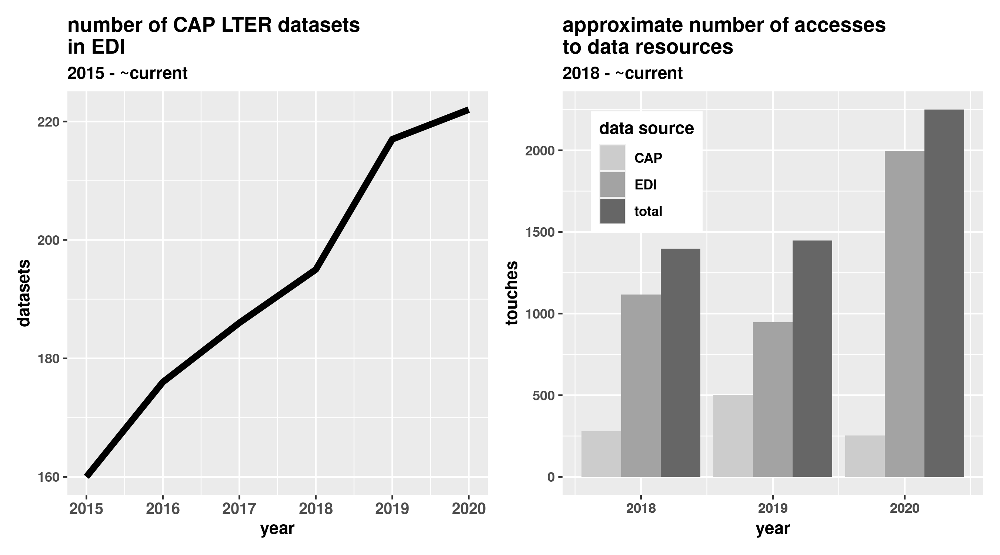
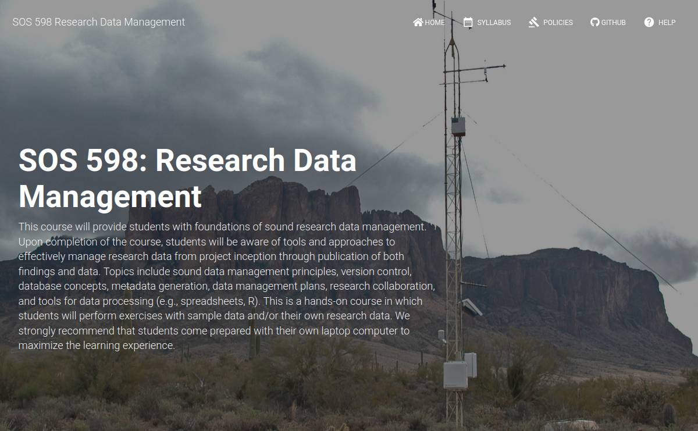

```{r setup, include=FALSE}
options(htmltools.dir.version = FALSE)
```

layout: true

background-image: url(assets/figures/template.png)
background-size: cover

---

.slide-title-font[information management at the CAP LTER]

**S. Earl**

**2020-10-21**


---
.slide-title-font[goals]

.middle[
archive well-structured and -documented research data in a long-term data repository for the benefit of the scientific community, decision makers, and public
]

---
.slide-title-font[goals]

.middle[
enable and promote data discovery and access
]

---
.slide-title-font[goals]

.middle[
support CAP LTER knowledge-generating enterprise
]

---
.slide-title-font[goals]

.middle[
provide leadership and education on sound information management
]

???

# goals

---
class: top

.slide-title-font[infrastructure]

.center[
  
]

???

# infrastructure


---
.slide-title-font[workflow] *from data generation to publication*

.center[
  
]

???

# workflow

---
.slide-title-font[data policies]

.middle[

* metadata encoded in the Ecological Metadata Language schema

* Creative Commons: CC0 – No Rights Reserved<sup>*</sup>

* novel research results published within 2 years of project completion<sup>*</sup>

* ~ annual updates to long-term monitoring data
]

.small[
<sup>*</sup>per LTER Network policy
]

???

# policies


---
.slide-title-font[data access]

.center[
  
]

.center[
.small[~ 24K file downloads]
]

???

# data use

---
.slide-title-font[data access]

<br>
<br>

.middle-big-text[
Zhang, Y. and B. Turner II. 2020. Land-cover mapping of the central Arizona region based on 2015 National Agriculture Imagery Program (NAIP) imagery ver 1. Environmental Data Initiative. https://doi.org/10.6073/pasta/e671ed549a55fda3338b177a2ad54487 (Accessed 2020-10-18).
]

---
.slide-title-font[education]

.middle[

* events

* invited talks

* embed with labs

]

???

# education


---
.slide-title-font[education]

.center[
  
]

???

# education: RDM


---
.slide-title-font[engagement] .wildstrawberry[*LTER Network; informatics and ecological communities*]

.middle[
co-chair, LTER Information Management Executive Committee
]

---
.slide-title-font[engagement] .wildstrawberry[*LTER Network; informatics and ecological communities*]

.middle[
information manager, LTER synthesis working group(s)
]

---
.slide-title-font[engagement] .wildstrawberry[*LTER Network; informatics and ecological communities*]

.middle[

* presenter, informatics and ecological conferences

* co-author, informatics and ecological journals
]

???

# engagement: lter, sci.

---
.slide-title-font[engagement] .wildstrawberry[*ASU and CAP LTER colleagues*]

.middle[
contributor: proposals, data management plans, analyses
]

???

# engagement: ASU, CAP

---
.slide-title-font[moving forward]

---
.slide-title-font[moving forward]

.middle[
unified data publishing and discovery system with EDI as the primary repository for all CAP data
]


---
.slide-title-font[moving forward]

.middle[
tools to enable scripted approaches to EML generation
]

---
.slide-title-font[moving forward]

.middle[
enhance discoverability and accessibility of data (e.g., including ORCiDs,  GitHub::DataONEorg/object-formats)
]


???

# moving forward


---

<br>
<br>
<br>
<br>

.center[

]

???

# closing slide
